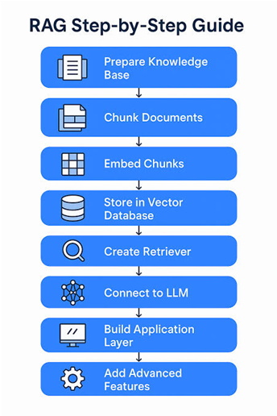

# Agentic RAG – US-Iran War

This project is an **Agentic RAG (Retrieval-Augmented Generation)** system built to answer questions from a dataset related to the **US-Iran War and related events**.

The system uses AI agents to decide how to retrieve and use relevant information before generating an answer.

### Technologies Used

- **LangChain** – RAG and agent framework
- **ChromaDB** – Vector database for storing and retrieving documents
- **Agents** – Handle retrieval and reasoning
- **Groq LLM** – Generates the final answers
- **Python** – Development language

### How It Works

```text
User Question
      ↓
     Agent
      ↓
  ChromaDB
      ↓
Relevant Information
      ↓
   Groq LLM
      ↓
  Final Answer
```


The documents are first converted into embeddings and stored in ChromaDB. When a user asks a question, the agent retrieves the relevant information and passes it to the Groq LLM to generate a response.

### Project Files

- **Agents.py** – This code provides the agents to main application
- **main.py** – This Python file is main code to execute the A-RAG for News Dataset.
- **create_and_test.py** – This code is used to create Vector Database and Initially used for Testing.
- **test_rag.py** – Once the Vector Database is Created this script helped to load and test the vector database.
- **chromadb.py** – This Scripts is used to understand the working of Chroma Vector Stores and how it works.


### Goal

The main goal of this project is to build a simple **agent-based RAG system** that can retrieve information from the US-Iran War dataset and provide useful, context-based answers.

> This project is developed for **educational and research purposes**.
